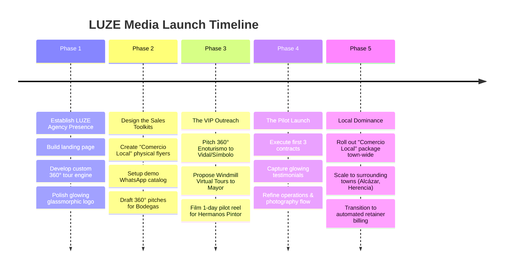

# LUZE Media Marketing - Strategic Business Plan
## Campo de Criptana, Castile-La Mancha

---

## 1. Executive Vision

**LUZE Media Marketing** is positioned to become the premier digital growth partner in Campo de Criptana and the surrounding region. In small municipalities, digital success is not about massive, expensive ad campaigns—it is about **trust, foot traffic, booking conversions, and civic pride**. 

By leveraging high-profile local relationships and offering hyper-focused, low-friction packages, LUZE will bridge the gap between historic La Mancha heritage and modern digital visibility.

---

## 2. Product & Service Tiering

We avoid generic agency services. We offer three distinct tiers tailored to Criptana's specific economic sectors:

### Tier 1: "Comercio Local Exprés" (High Volume, Recurring Revenue)
*   **Target**: Local bars, restaurants, bakeries, butcher shops, hardware stores, hair salons.
*   **The Package**: 
    1.  **Google Maps Optimization**: Setup, verification, accurate hours, phone numbers, and initial high-quality photos.
    2.  **WhatsApp Business Catalog**: Creating a structured WhatsApp listing for orders/bookings (essential in Spain).
    3.  **Web Tarjeta (1-Page Site)**: Fast, mobile-responsive single page containing basic info, menu/catalog, location, and a prominent "Order via WhatsApp" button.
    4.  **QR Storefront Kit**: A physical, branded acrylic standee with a QR code for their window so customers can scan it to order or view their digital menu.
*   **Pricing**: **€149 setup fee** + **€19/month** (covers hosting and quarterly Google Profile updates).

### Tier 2: "Alojamientos & Inmobiliaria 360°" (Medium Ticket)
*   **Target**: *Casas Rurales*, traditional *Casas Cueva* (Cave Houses), boutique lodgings, and selected real estate agencies.
*   **The Package**:
    1.  **360° Interactive Virtual Tour**: Immersive virtual walkthrough of the property.
    2.  **Professional Photography Pack**: 15–20 high-dynamic-range (HDR) interior and exterior photos (replacing "shitty mobile pics").
    3.  **Booking Engine Integration**: Enhancing their direct booking channels or optimization of Airbnb/Booking.com listings to display the new media.
*   **Pricing**:
    *   *Casas Rurales*: **€349 flat fee** per property.
    *   *Real Estate Subscription*: **€199/month** (covers up to 3 standard listings per month, building long-term agency recurring revenue).

### Tier 3: "Enoturismo & Agro-Industria Premium" (High Ticket)
*   **Target**: Historic wineries (*Bodegas*), industrial factories (*Hermanos Pintor*), and high-end local producers.
*   **The Package**:
    1.  **Enoturismo Booking Platform**: Multi-language, highly polished reservation system for wine tastings and vineyard tours.
    2.  **Subterranean Cave/Cellar 360° Tour**: Breathtaking virtual tours of the barrel cellars (*cunas de barricas*) and storage facilities to attract high-paying tourists from Madrid and abroad.
    3.  **Brand Video & Social Storytelling**: High-end reels/TikToks showing the heritage, harvest (*vendimia*), cooking pairing, or potato chip frying process.
*   **Pricing**: **€1,999 – €3,999 setup** + **€299 – €499/month retainer** (covers social media management, localized ads, and technical support).

---

## 3. The "Cheat Code" Networking Strategy

Having direct ties to the **Mayor**, **Bodega Vidal**, **Bodegas Símbolo**, and **Hermanos Pintor** is your unfair competitive advantage. In a small town, a personal introduction beats a cold email 100% of the time. Here is the exact outreach blueprint:

### Play 1: The Enoturismo Showdown (Vidal & Símbolo)
*   **The Hook**: Pitch the 360° virtual tour as a way to capture the weekend tourism crowd coming from Madrid on the *Tren de los Molinos*.
*   **The Pitch**: 
    > *"Everyone in Madrid knows your wine, but they don't know the beauty of your subterranean cellars. Let's create an immersive 360° walkthrough of the bodega. When a tourist visits our new website, they don't just see a bottle; they step inside the history. They book their tasting tour instantly."*
*   **The Action**: Use the interactive 360° viewer on the LUZE Media website as a live demo on your phone during a lunch or meeting with them.

### Play 2: The Civic Authority Play (The Mayor)
*   **The Hook**: Frame digital presence as a matter of civic duty and municipal tourism growth.
*   **The Pitch**: 
    > *"We want to digitalize Criptana's heritage and small businesses. We can build a unified digital portal 'Criptana Digital' or create high-end 360° tours of municipal sights (historic windmills, El Pósito, Cerro de la Paz) so global tourists can explore Criptana virtually."*
*   **The Action**: Present a proposal to create virtual tours for the tourist office. This project will instantly establish LUZE as the official, trusted digital agency in the region, which you can use as massive social proof when pitching small local shops.

### Play 3: The Local Staple Upgrade (Hermanos Pintor)
*   **The Hook**: Turn a traditional, beloved local product into a modern social media icon.
*   **The Pitch**: 
    > *"Hermanos Pintor makes the best chips in La Mancha, but the younger generation is on TikTok and Instagram. Let's create aesthetic, fast-paced video content showing the satisfying crunch, the frying process, and the local roots. We can run target ads across Ciudad Real and Toledo to double your regional wholesale distribution."*
*   **The Action**: Offer to do a 1-day pilot video shoot for a single collaborative reel. Once it gets thousands of local views, lock them into a monthly content retainer.

---

## 4. Step-by-Step Action Roadmap

### Phase 1: Establish LUZE Agency Presence (Days 1 - 3)
*   **Goal**: Build the flagship LUZE Media website.
*   **Key Deliverable**: A bilingual landing page with the interactive 360° viewer, pricing calculator, and the glowing "vibcoded" CSS logo to prove technical capability.

### Phase 2: Design the Sales Toolkits (Days 4 - 7)
*   **Goal**: Prepare physical and digital sales collaterals.
*   **Key Deliverable**:
    *   A simple PDF presentation of the "Enoturismo 360°" package for wineries.
    *   A mockup of the storefront "QR Acrylic Standee" to show local restaurant owners.

### Phase 3: The VIP Outreach (Days 8 - 14)
*   **Goal**: Secure the first premium accounts using your network.
*   **Key Deliverable**:
    *   Set up casual meetings with Bodega Vidal, Bodegas Símbolo, the Mayor, and Hermanos Pintor.
    *   Demonstrate the 360° tour live on your tablet/phone. Offer them a special "Lanzamiento Local" (Local Launch) pricing.

### Phase 4: Execute & Capture Case Studies (Days 15 - 30)
*   **Goal**: Deliver exceptional quality on the first projects.
*   **Key Deliverable**:
    *   Shoot and launch the 360° tour for the winning Bodega or Casa Rural.
    *   Record a professional video testimonial from the owner.
    *   Publish these case studies on the LUZE website.

### Phase 5: Scale to Mass Market (Month 2+)
*   **Goal**: Build high-volume monthly recurring revenue.
*   **Key Deliverable**:
    *   Equipped with the endorsement of the Bodegas, the Mayor, and Hermanos Pintor, pitch the "Comercio Local Exprés" (€149 + €19/mo) package to every single bar, restaurant, and retail store in Campo de Criptana.
    *   Expand sales outreach to neighboring towns like Alcázar de San Juan and Herencia.
